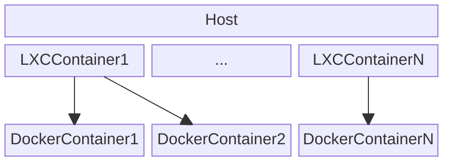

# Easily use Docker containers inside LXC containers

This repository contains a script that enables easy configuration of LXC containers that use docker inside them. This script abstracts from having to create the volumes for the docker containers, copying images and managing docker inside the LXC container.

IMPORTANT: Docker containers inside the LXC Container are orquestrated using a docker compose file. This docker compose file MUST define which docker containers should be started and how. 

# Example of infrastructure

