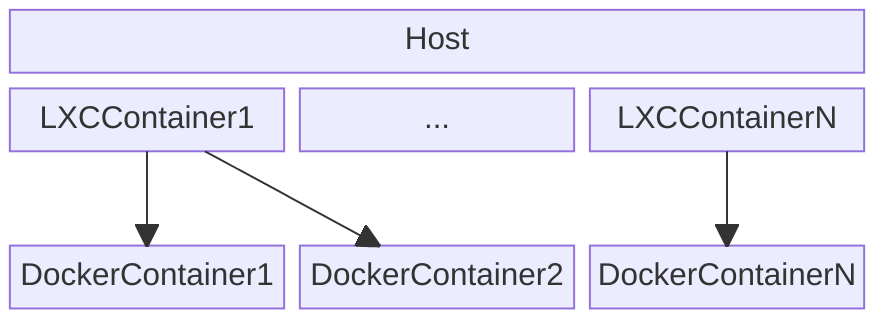

# Easily use Docker containers inside LXC containers

This repository contains a script that enables easy configuration of docker inside LXC containers. This script abstracts from having to create the volumes for the docker containers, copying images and managing docker inside the LXC container.

**IMPORTANT**: Currently, docker containers inside the LXC Container are orquestrated using a docker compose file. This docker compose file MUST define which docker containers should be started and how. 

# Example of infrastructure


# Installation

1. Create a python virtual environment. (_requires python 3.12_)
```bash
python3 -m venv venv
```

2. Activate the virtual environment.
```bash
source ./venv/bin/activate
```

3. Execute `python3 ./lxcops.py -h` to see if its working.

4. Try the following example:
```bash
python lxcops.py example_files/docker-compose.yaml -i "ubuntu:jammy" -n "test" -b
```
- A path to a docker compose file is passed as argument. 
- Creates a new LXC container based on ubuntu jammy and named "test".
- The `-b` option is used to build the new LXC container from scratch, cleaning up all dependencies and installing everything from the ground up.

You can also upload a project in `.tar.gz` format with a Dockerfile inside with the `-l` option. This will build the docker image and thus it will be available to use inside the compose `.yaml` file.

# Release plan

## Version 0.1
- Define new `.yaml` format that defines the containers to be run inside the LXC container.
  - This format MUST allow Dockerfile support -> "dockerfile": "<path_to_dockerfile>"
  - This format acts as a wrapper for a docker compose file. 
  - If a dockerfile is defined in the `.yaml`, then that dockerfile will be used as the image defined in the compose file.
- Support for different LXC images.
- Possibility to link docker volumes with LXC volumes.
- Dockerfile support
- Docker image support
- Migrate help script and data parse to python. Keep the container management in bash.
