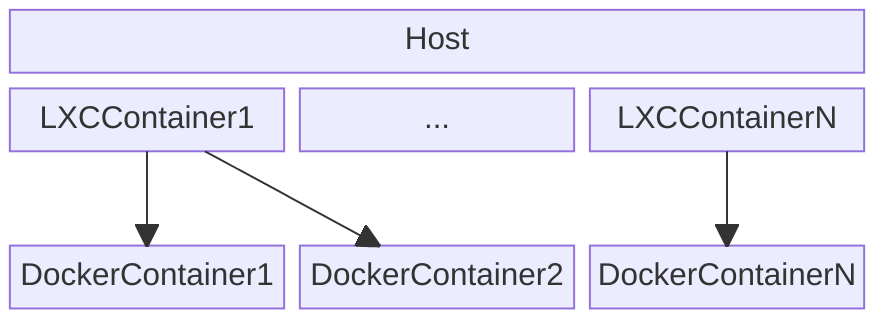

# LxcDevOps

This repository contains a script that enables easy configuration of LXC containers that use docker inside them. This script abstracts from having to create the volumes for the docker containers, copying images and managing docker inside the LXC container.

# Example of infrastructure

